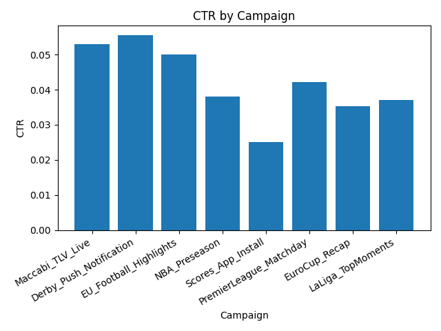
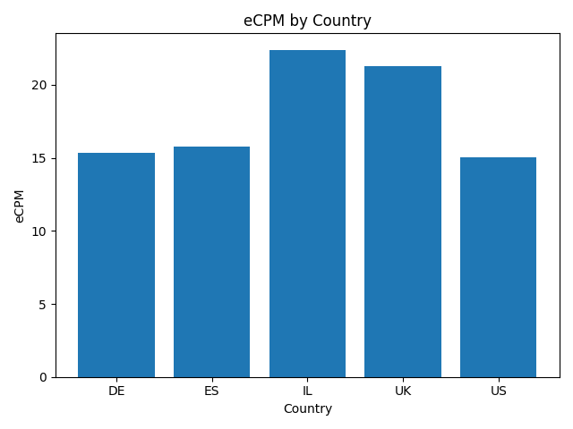

# Ad Ops – Data Analysis with Python

A compact demo project showing how to analyze ad campaign data with **Pandas** and **matplotlib**.  
The dataset simulates campaigns from a sports app (push, in-app, web traffic across multiple countries).

## Features
- Clean and process campaign-level data from `data.csv`
- Compute KPIs:
  - **CTR** (Click-through rate)
  - **Fill Rate**
  - **eCPM** (effective cost per mille)
- Group analysis by **source** and **country**
- Generate charts:
  - CTR by Campaign
  - eCPM by Country

## Example Output

Tables printed to console (KPIs per campaign, by source, by country):
```
KPI Summary per campaign:
campaign_id CTR eCPM Fill_Rate
Maccabi_TLV_Live 0.0530 22.19 0.167
Derby_Push_Notification 0.0554 22.83 0.083
```

### CTR by Campaign


### eCPM by Country


## Requirements
```
pandas
matplotlib
numpy
```
## Install
```bash
pip install -r requirements.txt
python analysis.py
```
## Notes

- Data is synthetic but tailored to an Ad Ops scenario for a sports app.
- Purpose: showcase skills in Python, Pandas, KPIs, data visualization.
- Lightweight demo project – meant to be read and run easily.
